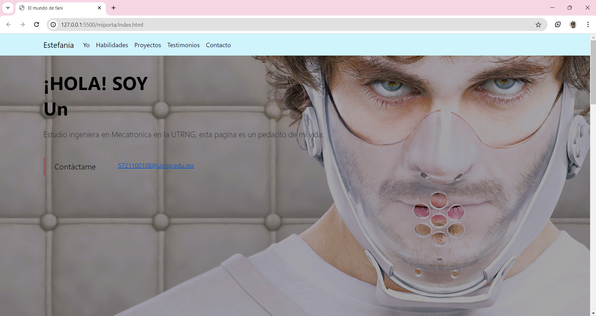

# Mi portafolio de Technolochicas PRO

 
Este portafolio fue creado como parte de la práctica de habilidades adquiridas en un bootcamp de desarrollo frontend.

El desarrollo del portafolio se llevó a cabo utilizando HTML, CSS y JavaScript, con la incorporación del framework Bootstrap para facilitar el diseño responsive y la estructura del sitio. Además, se aprovecharon animaciones de bibliotecas externas para mejorar la experiencia del usuario y añadir interactividad al sitio.

El objetivo principal del proyecto fue aplicar y consolidar los conocimientos adquiridos durante el bootcamp, demostrando habilidades en el desarrollo frontend y la utilización de herramientas modernas para crear interfaces web atractivas y funcionales.
 

- Tecnologías
* HTML
* CSS
* Javascript
* Bootstrap 5

[Proyecto en linea](https://gentle-rolypoly-fb079f.netlify.app/)

- Capturas de pantalla

* Sección de inicio.

* Sección de proyectos.

* Sección de testimonios.

* Sección de pie de pagina.

- Créditos